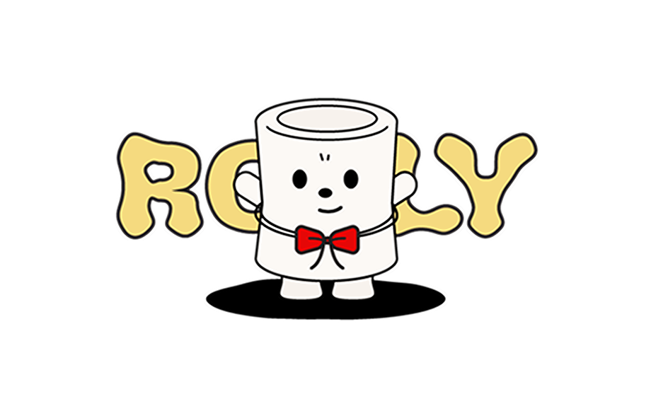

# 📃 Rolly : 디지털 롤링페이퍼



## 🔗 배포 링크

링크

## 💁🏻‍♀ 프로젝트 소개

"우리 프로젝트는 디지털 롤링페이퍼 서비스입니다.
아날로그 롤링페이퍼가 주는 따뜻함, 당사자 몰래 많은 사람들이 롤링페이퍼를 준비하는 설렘, 그리고 감사의 답장이 만들어내는 소중한 추억을 디지털 공간에서도 그대로 느낄 수 있도록 구현했습니다.
마음이 오가는 순간을 담아, 특별한 기억으로 남길 수 있도록."

## 👩🏻‍💻 구성원

<table>
  <tbody>
    <tr>
      <td align="center">
        <a href=""><br />
        <sub><b>팀장 : 김민준</b></sub></a><br />
        <ul align="left">
          <li>자체 회원가입, 로그인</li>
          <li>스티커 꾸미기 기능</li>
        </ul>
      </td>
      <td align="center">
        <a href=""><br />
        <sub><b>팀원 : 엄하영</b></sub></a><br />
        <ul align="left">
          <li>포스트잇 작성 기능</li>
          <li>이메일 일괄 답장 기능</li>
        </ul>
      </td>
      <td align="center">
        <a href=""><br />
        <sub><b>팀원 : 윤지수</b></sub></a><br />
        <ul align="left">
          <li>카카오 연동 회원가입 및 로그인</li>
          <li>롤리 생성 기능</li>
        </ul>
      </td>
    </tr>
  </tbody>
</table>

## 🛠️ 기술

### ✔️ Frond-end


### ✔️ Back-end


### ✔️ DESIGN


### ✔️ Common / DevOps


## 📁 디렉터리 구조

#### 클린 아키텍처 형식의 구조

```
app/
├── (anon)/          # 비로그인 사용자
│   ├── login/
│   ├── rollies/
│   │   └── [id]/
│   └── ...
├── api/
│   ├── login/
│   │   └── route.ts
│   └── ...
├── auth/            # 인증 관련 페이지
│   ├── callback/
├── member/          # 로그인한 사용자
│   ├── postits/
│   │   └── create/
│   └── ...
├── global.scss      # 글로벌 스타일
└── layout.tsx       # 전체 레이아웃
application/
├── state/
│    └── useRollyStore.ts
│    └── ...
├── usecases/
│   ├── rolly/
│       └── dto/
│       └── DfCreateRollyUsecase.ts
│   └── ...
components/
├── modal/
└── ...
domain/
├── entities/
│   ├── User.ts
│   ├── Rolly.ts
│   └── ...
├── repositories/
│   ├── UserRepository.ts
│   └── ...
hooks/
├── useToggle.ts
infrastructure/
└── repositories/
│    ├── SbUserRepository.ts
│    └── ...
utils/
└── supabase/
     └── server.ts
```

## 컨벤션

### 커밋 컨벤션

```
✨ feat: 새 기능 추가
🐛 fix: 버그 수정
📝 docs: 문서 추가/수정
💄 style: UI/style 파일 추가/수정
♻️ refactor: 코드 리팩토링
🔧 chore: 구성 파일 추가 / 삭제
```

### PR 컨벤션

```
### Description
-
-

CheckList
- [ ]
- [ ]
```

### 코드 리뷰 컨벤션

```
LGTM 👍🏻
IMO 💬
```
