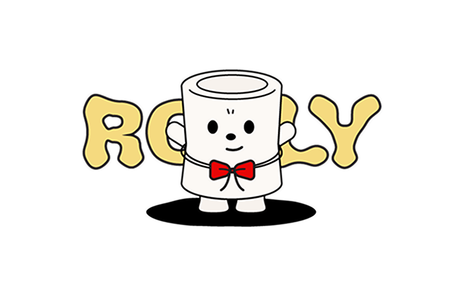
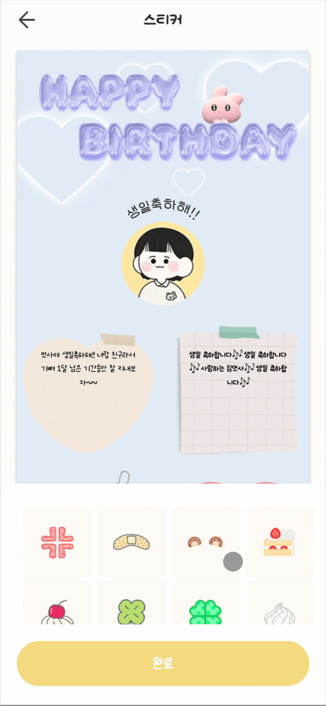
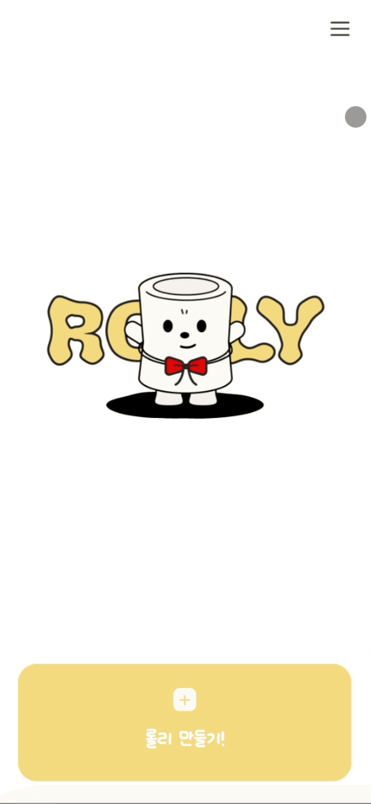
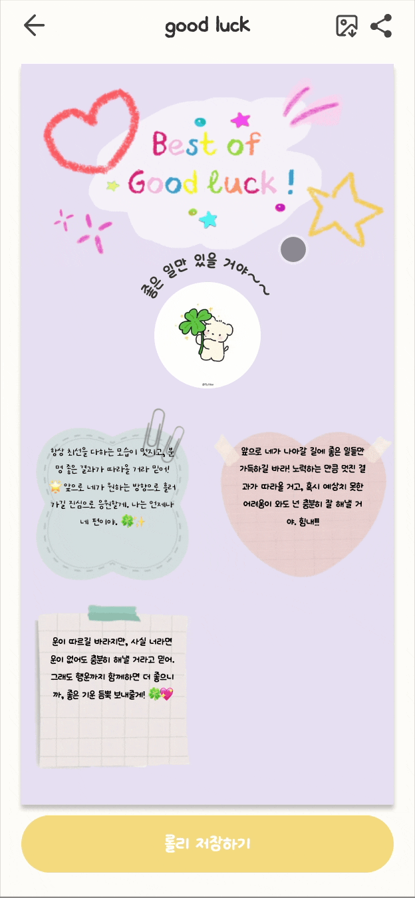
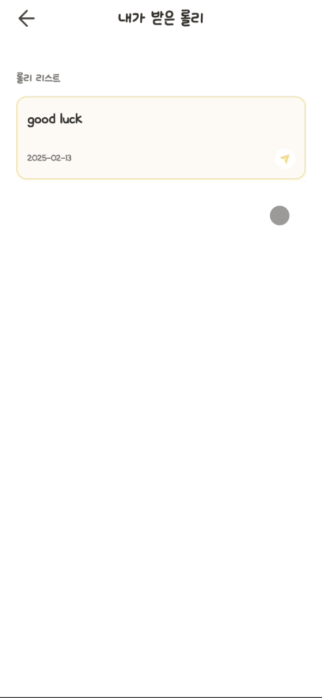
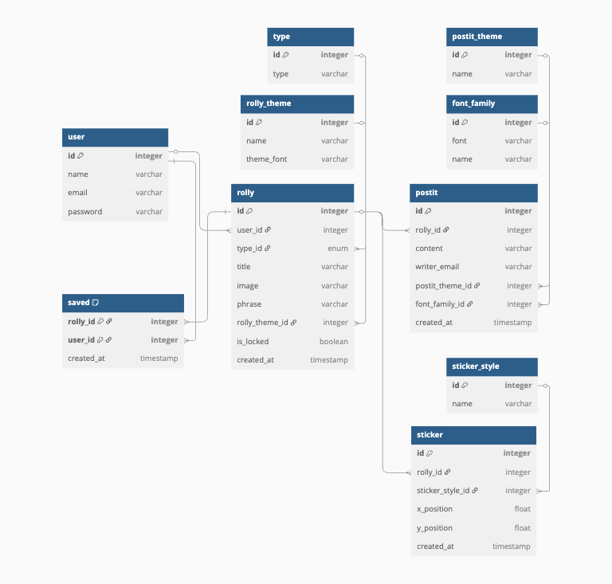
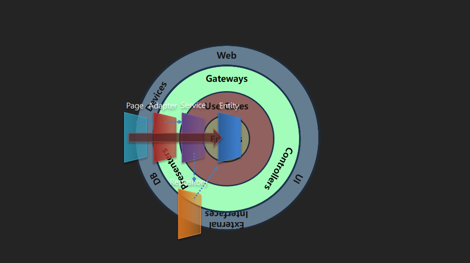
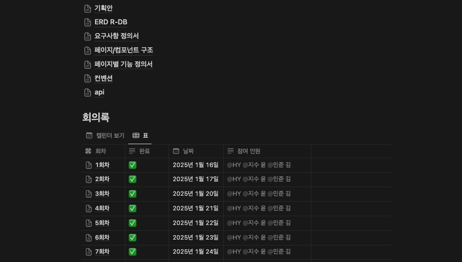

# 📃 Rolly : 디지털 롤링페이퍼

### 모두의 마음이 채워져 선물이 되는 순간!

<p align="center">
  
</p>

## 🔗 배포 링크

> https://rolling-memory.vercel.app

|       ID       | Password  |
| :------------: | :-------: |
| rolly@user.com | rolly123! |

<br/>

## 🗂️ 목차

- [💁🏻‍♀ 프로젝트 소개](#-프로젝트-소개)
- [✨ 기능 소개](#-기능-소개)
- [👩🏻‍💻 구성원](#-구성원)
- [🛠️ 기술 스택](#-기술-스택)
- [💾 ERD](#-ERD)
- [📁 디렉터리 구조](#-디렉터리-구조)
- [💻 협업 환경](#-협업-환경)

<br/>

## 💁🏻‍♀ 프로젝트 소개

롤리는 디지털 롤링페이퍼 서비스입니다.
아날로그 롤링페이퍼가 주는 따뜻함, 당사자 몰래 많은 사람들이 롤링페이퍼를 준비하는 설렘, 그리고 감사의 답장이 만들어내는 소중한 추억을 디지털 공간에서도 그대로 느낄 수 있도록 구현했습니다. <br/>
<br/>
"마음이 오가는 순간을 담아, 특별한 기억으로 남길 수 있도록."

<br/>

## ✨ 기능 소개

### 롤링페이퍼 생성

| 롤링페이퍼 만들기 | 메시지 작성하기 | 스티커 붙이기 |
| :------------: | :------------: | :------------: |
|  |  |  |

### 롤링페이퍼 관리

| 롤링페이퍼 완성/삭제하기 | 롤링페이퍼 공유/저장하기 | 답장하기 |
| :------------: | :------------: | :------------: |
|  |  |  |

### 로그인/회원가입

| 이메일 로그인 | 카카오 로그인 | 회원가입 |
| :------------: | :------------: | :------------: |
|  |  |  |

<br/>

## 👩🏻‍💻 구성원

<table>
  <tbody>
    <tr>
      <td align="center">
        <br />
        <sub><b>팀장 김민준</b></sub><br /><br />
        <ul align="left">
          <li>자체 회원가입, 로그인</li>
          <li>스티커 꾸미기 기능</li>
          <li>롤리 공유 및 저장 기능</li>
        </ul>
      </td>
      <td align="center">
        <br />
        <sub><b>팀원 엄하영</b></sub><br /><br />
        <ul align="left">
          <li>포스트잇 작성 기능</li>
          <li>롤리 잠금 및 삭제 기능</li>
          <li>이메일 일괄 답장 기능</li>
        </ul>
      </td>
      <td align="center">
        <br />
        <sub><b>팀원 윤지수</b></sub><br /><br />
        <ul align="left">
          <li>롤리 생성 기능</li>
          <li>롤리 상세 조회 기능</li>
          <li>카카오 소셜 로그인</li>
        </ul>
      </td>
    </tr>
  </tbody>
</table>

<br/>

## 🛠️ 기술 스택

### ✔️ Frond-end

     

### ✔️ Back-end


### ✔️ Design


### ✔️ Collaboration

   

<br/>

## 💾 ERD



<br/>

## 📁 디렉터리 구조

### 클린 아키텍처 사용

```
app/
├── (anon)/          # Presentation 계층: UI 페이지(비로그인 사용자)
│   ├── login/
│   │   └── page.tsx
│   ├── rollies/
│   │   └── [id]/
│   └── ...
├── api/             # Adapter 계층: API Routes
│   ├── login/
│   │   └── route.ts
│   └── ...
├── member/          # Presentation 계층: UI 페이지(로그인 사용자)
│   ├── postits/
│   │   └── create/
│   └── ...
├── global.scss
└── layout.tsx

application/         # Application 계층: 애플리케이션의 비즈니스 로직 처리
└── usecases/
    ├── rolly/
        └── dto/
        └── DfCreateRollyUsecase.ts
    └── ...

components/
├── modal/
└── ...

domain/              # Domain 계층: 도메인 모델 정의
├── entities/
│   ├── User.ts
│   ├── Rolly.ts
│   └── ...
└── repositories/
    ├── UserRepository.ts
    └── ...

infrastructure/      # Infrastructure 계층: 외부 서비스 사용
└── repositories/
     ├── SbUserRepository.ts
     └── ...
```



<br/>

## 💻 협업 환경

### 협업 방식

- 피그마 디자인 시스템 사용

- 노션에 정보 공유 및 회의록, 요구사항, 컨벤션 정리

- Git Flow 브랜치 전략 사용

### 컨벤션

- 커밋 컨벤션

```
✨ feat: 새 기능 추가
🐛 fix: 버그 수정
📝 docs: 문서 추가/수정
💄 style: UI/style 파일 추가/수정
♻️ refactor: 코드 리팩토링
🔧 chore: 구성 파일 추가 / 삭제
```

- PR 컨벤션

```
### Description
-
-

### CheckList
- [ ]
- [ ]
```

- 코드 리뷰 컨벤션

```
LGTM 👍🏻
IMO 💬
```
